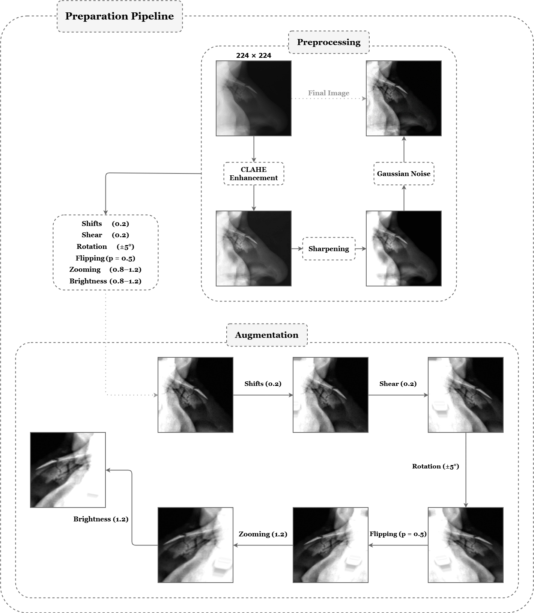
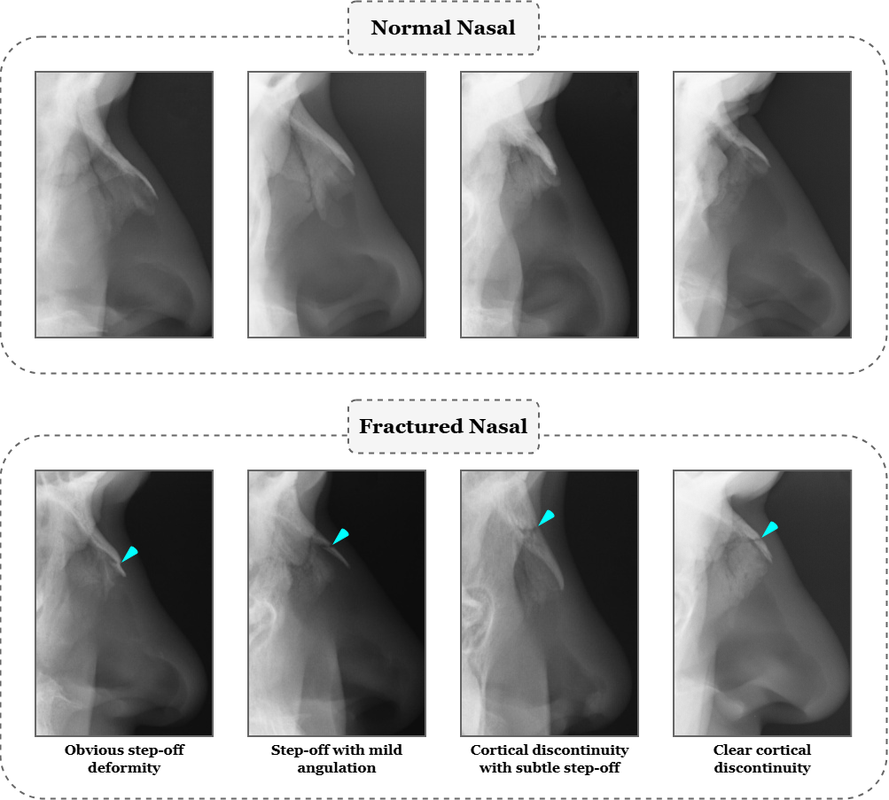

# MoE-Net  
## Genetic Algorithm–Optimized Mixture of Experts for Nasal Bone Fracture Detection

MoE-Net is a structured deep learning–based ensemble framework designed for automated nasal bone fracture detection in lateral-view radiographs. The framework integrates multiple specialized CNN experts and employs Genetic Algorithm–based adaptive weight optimization to enhance diagnostic reliability and performance stability.

This repository contains the official implementation accompanying our publication in *Intelligence-Based Medicine (2026)*.

---

## Key Contributions

- Structured Mixture-of-Experts framework for medical X-ray classification  
- Genetic Algorithm–based adaptive expert weight optimization  
- Domain-informed preprocessing pipeline for enhanced anatomical visibility  
- Grad-CAM–based interpretability analysis  
- 13% improvement in diagnostic accuracy over the baseline single-model approach  
- Extensive experimental validation across CNN and Vision Transformer backbones  

---

## MoE-Net Architecture

  

MoE-Net integrates three high-performing CNN experts—InceptionResNetV2, DenseNet121, and Xception—within a structured Mixture-of-Experts framework. A Genetic Algorithm optimizes expert contribution weights to balance sensitivity and specificity while mitigating model bias. Unlike naive averaging, expert collaboration is learned adaptively.

---

## Performance Results

### Comparative Evaluation

### Table 3  
**Comparative performance metrics of individual and ensemble models in nasal bone fracture detection.**

### Table 3  
**Comparative performance metrics of individual and ensemble models in nasal bone fracture detection.**

| Deep model                          | Accuracy (%)          | Sensitivity (%)       | Specificity (%)       | F₂-Score (%)          | AUC (%)               | MCC (%)               | P-Value     |
|-------------------------------------|-----------------------|-----------------------|-----------------------|-----------------------|-----------------------|-----------------------|-------------|
| **Convolutional Neural Networks (CNNs)** |||||||
| DenseNet121                         | 83.18 (80.5–85.5)     | 83.18 (80.5–85.5)     | 77.72 (76.0–79.5)     | 83.09 (81.5–85.5)     | 83.33 (81.5–85.5)     | 66.94 (65.0–68.5)     | 0.014       |
| Xception                            | 82.28 (80.0–84.5)     | 82.28 (80.0–84.5)     | **91.70** (90.0–93.5) | 82.04 (80.5–84.8)     | 82.02 (80.0–84.0)     | 65.50 (63.5–67.5)     | 0.006       |
| ResNet101V2                         | 82.06 (80.5–84.0)     | 82.06 (80.5–84.0)     | 79.91 (78.0–81.5)     | 82.04 (80.5–84.0)     | 82.12 (80.5–84.0)     | 64.24 (62.5–65.8)     | 0.004       |
| InceptionResNetV2                   | 87.21 (85.5–88.8)     | 87.21 (85.5–88.8)     | 86.02 (84.5–87.5)     | 87.21 (85.5–88.8)     | 87.25 (85.5–88.8)     | 74.47 (73.0–75.8)     | 0.018       |
| MobileNetV3                         | 74.66 (72.0–77.5)     | 74.66 (72.0–77.5)     | 80.78 (79.0–82.5)     | 74.56 (72.0–77.5)     | 74.49 (72.0–77.0)     | 49.45 (47.5–51.5)     | <0.0001     |
| **Vision Transformers (ViTs)**     |||||||
| CaiT                                | 86.77 (85.0–88.5)     | 86.77 (85.0–88.5)     | 86.46 (85.0–88.0)     | 86.77 (85.0–88.5)     | 86.77 (85.0–88.5)     | 73.53 (72.0–75.0)     | 0.012       |
| PiT                                 | 80.26 (78.0–82.5)     | 80.26 (78.0–82.5)     | 78.16 (76.5–80.5)     | 80.25 (78.0–82.5)     | 80.32 (78.0–82.5)     | 60.65 (58.5–62.5)     | 0.001       |
| DeiT                                | 78.69 (76.5–80.5)     | 78.69 (76.5–80.5)     | 85.64 (74.0–77.5)     | 78.66 (71.5–80.5)     | 78.78 (76.5–80.5)     | 58.32 (56.0–59.5)     | <0.0001     |
| ViT                                 | 73.54 (71.0–88.5)     | 73.54 (71.0–88.5)     | 85.64 (85.0–87.5)     | 73.02 (71.5–80.5)     | 78.78 (76.5–80.5)     | 58.36 (56.0–59.5)     | <0.0001     |
| PVT                                 | 68.16 (66.0–70.5)     | 68.16 (66.0–70.5)     | 76.85 (75.0–78.5)     | 67.94 (66.0–70.5)     | 67.92 (66.0–70.0)     | 36.48 (34.5–38.5)     | <0.0001     |
| **Ensemble Models**                 |||||||
| MoE-Net (Base)                      | 91.70 (90.5–92.8)     | 91.70 (90.5–92.8)     | 89.95 (88.8–90.8)     | 91.69 (90.5–92.8)     | 91.75 (90.5–92.8)     | 83.48 (82.5–84.5)     | –           |
| MoE-Net (GA optimized)              | **91.92** (91.0–93.0) | **91.92** (91.0–93.0) | 89.51 (88.5–90.15)    | **91.91** (91.0–93.0) | **91.99** (91.0–93.0) | **83.98** (83.0–84.8) | –           |

The GA-optimized ensemble achieved the highest overall performance, demonstrating the advantage of structured model aggregation over isolated model improvements.

---

## Preprocessing Pipeline

  

The preprocessing workflow includes:

- ROI extraction for nasal bone isolation  
- Contrast enhancement using CLAHE  
- Edge sharpening  
- Gaussian noise injection for robustness  
- Controlled augmentation strategies  

This pipeline reduces domain-specific variability and enhances fracture feature visibility.

---

## Dataset

The dataset consists of lateral-view nasal bone radiographs labeled as:

- Normal  
- Fractured (including step-off deformity, angulation, and cortical discontinuity)

  

Due to privacy and ethical constraints, raw medical images are not publicly distributed.

---

## Citation

If you use this work in your research, please cite:

@article{MEHRPOUR2026100359,
title = {MoE-Net: A deep ensemble framework optimized by genetic algorithm for nasal bone fracture detection on lateral X-ray images},
journal = {Intelligence-Based Medicine},
volume = {13},
pages = {100359},
year = {2026},
issn = {2666-5212},
doi = {https://doi.org/10.1016/j.ibmed.2026.100359},
url = {https://www.sciencedirect.com/science/article/pii/S2666521226000177},
author = {Mobin Mehrpour and Seyed Abolghasem Mirroshandel and Tahereh Mortezaei and Zahra Dalili Kajan},
keywords = {Nasal bone fracture, Deep learning, Convolutional neural networks, Ensemble learning, Medical image analysis, Vision transformers, Genetic algorithm}
}

---

## Acknowledgements

We gratefully acknowledge:

- Prof. Seyed Abolghasem Mirroshandel — supervision and scientific guidance

- Dr. Zahra Dalili Kajan — clinical expertise and dataset supervision

- Dr. Tahereh Mortezaei — radiology annotations and validation

Their interdisciplinary collaboration was essential to this work.
